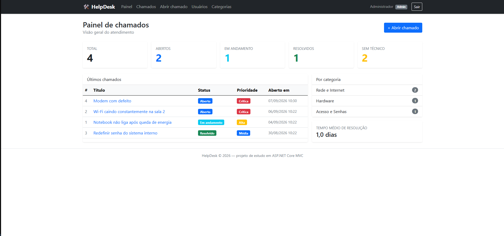
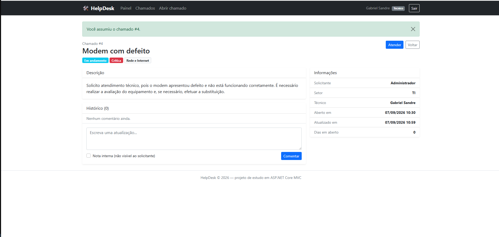
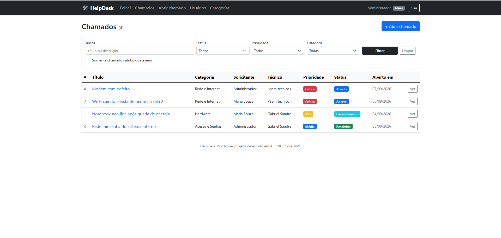
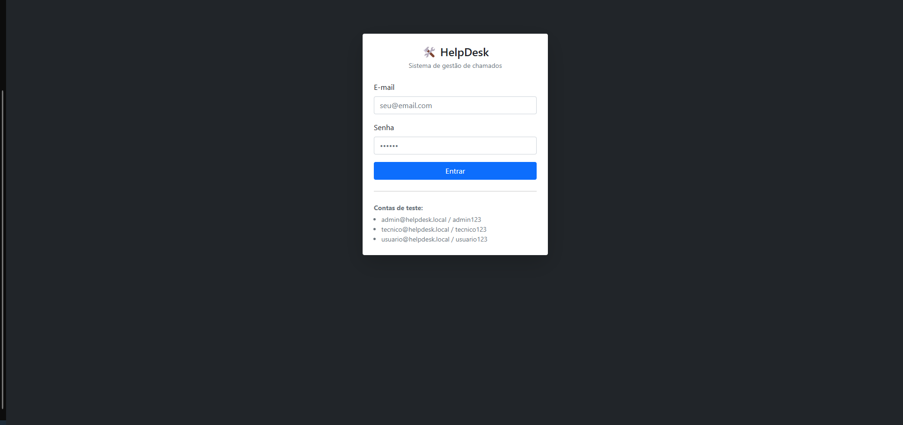

# HelpDesk — Sistema de Chamados

[](https://github.com/Gabriel-Sandre/helpdesk-aspnet-mvc/actions/workflows/ci.yml)
[](https://dotnet.microsoft.com/)
[](LICENSE)

Sistema web de abertura e acompanhamento de chamados de suporte técnico, feito em
**ASP.NET Core 10 MVC** com **Entity Framework Core**, rodando em **SQLite** ou
**SQL Server** conforme a configuração.

## Telas

**Painel com os indicadores do atendimento**



**Detalhe do chamado, com histórico e nota interna**



**Lista de chamados com busca e filtros**



**Login**



## Como rodar

Pré-requisito: [.NET SDK 10.0](https://dotnet.microsoft.com/download).

```bash
cd helpdesk-aspnet-mvc
dotnet restore
dotnet run
```

Abra o endereço que aparece no terminal (algo como `https://localhost:7xxx`).

Na configuração padrão o banco `helpdesk.db` (SQLite) é criado automaticamente na
primeira execução, já com categorias, usuários e chamados de exemplo — não é
preciso instalar nem configurar nada.

## Trocando o banco de dados

O projeto roda em **SQLite** ou **SQL Server**, sem mudar uma linha de código.
Quem escolhe é o `appsettings.json`:

```json
"DatabaseProvider": "Sqlite",

"ConnectionStrings": {
  "Sqlite": "Data Source=helpdesk.db",
  "SqlServer": "Server=.;Database=HelpDesk;Trusted_Connection=True;TrustServerCertificate=True"
}
```

- `"DatabaseProvider": "Sqlite"` — banco em arquivo, zero configuração (padrão).
- `"DatabaseProvider": "SqlServer"` — usa o SQL Server local. O banco `HelpDesk`
  é criado sozinho na primeira execução e aparece no SQL Server Management Studio.

Para uma instância nomeada, ajuste o `Server` da string de conexão
(ex.: `Server=.\\GABRIEL;` — barra invertida dupla, porque é JSON).
Ao subir, o terminal registra qual provedor está em uso.

## Contas de teste

| Perfil        | E-mail                   | Senha       |
|---------------|--------------------------|-------------|
| Administrador | admin@helpdesk.local     | admin123    |
| Técnico       | tecnico@helpdesk.local   | tecnico123  |
| Usuário       | usuario@helpdesk.local   | usuario123  |

## O que cada perfil pode fazer

- **Usuário** — abre chamados, acompanha e comenta apenas os próprios chamados.
- **Técnico** — vê todos os chamados, assume, muda status/prioridade, registra a
  solução e escreve notas internas (invisíveis para o solicitante).
- **Administrador** — tudo do técnico, mais cadastro de usuários e categorias e
  exclusão de chamados.

## Funcionalidades

- Login com cookie de autenticação e senha protegida com PBKDF2 (100.000 iterações + salt)
- Painel com indicadores: total, abertos, em andamento, resolvidos, sem técnico,
  tempo médio de resolução e distribuição por categoria
- Lista de chamados com busca por texto, filtros (status, prioridade, categoria,
  "somente os meus") e paginação
- Ciclo completo do chamado: abertura → atribuição → andamento → solução → reabertura
- Histórico de comentários por chamado, com opção de nota interna
- CRUD de usuários e de categorias (restrito ao administrador)
- Proteção contra CSRF em todos os formulários (antiforgery token)

## Estrutura do projeto

```
Controllers/    Base, Conta, Home (painel), Chamados, Usuarios, Categorias
Models/         Entidades (Usuario, Chamado, Categoria, Comentario) e enums
Models/ViewModels/  Objetos usados pelas telas (login, filtro, painel, atendimento)
Data/           AppDbContext (mapeamento EF Core) e DbInitializer (seed)
Services/       SenhaHasher (hash e verificação de senha)
Helpers/        UiHelper (cores dos badges e texto amigável dos enums)
Views/          Telas Razor + layout com Bootstrap 5
```

## Modelo de dados

- `Usuario` 1—N `Chamado` (como solicitante)
- `Usuario` 0..1—N `Chamado` (como técnico responsável)
- `Categoria` 1—N `Chamado`
- `Chamado` 1—N `Comentario`

## Observações técnicas

- O banco é criado com `EnsureCreated()`, que monta as tabelas a partir das classes
  do projeto (abordagem Code First). Para trabalhar com migrations:
  `dotnet ef migrations add Inicial` e `dotnet ef database update`
  (troque a chamada no `DbInitializer` por `db.Database.Migrate()`).
- Para zerar os dados de teste: no SQLite, apague o arquivo `helpdesk.db`; no SQL
  Server, exclua o banco `HelpDesk` pelo SSMS. Em ambos os casos ele é recriado na
  próxima execução.

## Melhorias futuras

Sei o que falta neste projeto, e é o que eu faria em seguida:

- **Testes automatizados** (xunit) para as regras do chamado: atribuição, mudança de status,
  reabertura e visibilidade da nota interna. Hoje o projeto não tem nenhum.
- **Migrations** no lugar de `EnsureCreated()`, para evoluir o banco sem recriá-lo.
- **Paginação e filtros no servidor** também na tela de usuários e categorias.
- **Anexos nos chamados** (print do erro é o que todo suporte pede primeiro).
- **Notificação por e-mail** quando o chamado muda de status.
